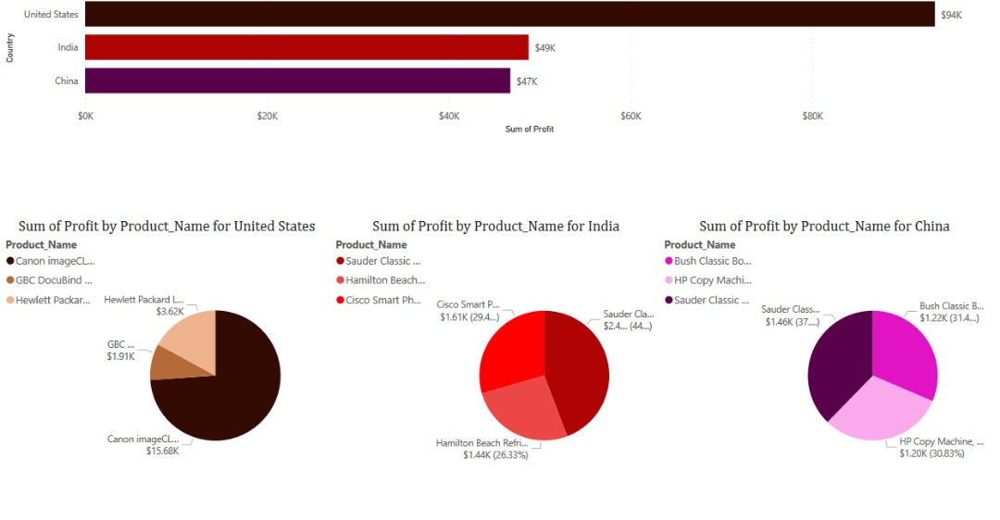
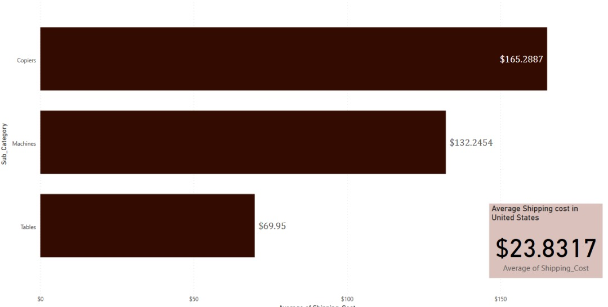
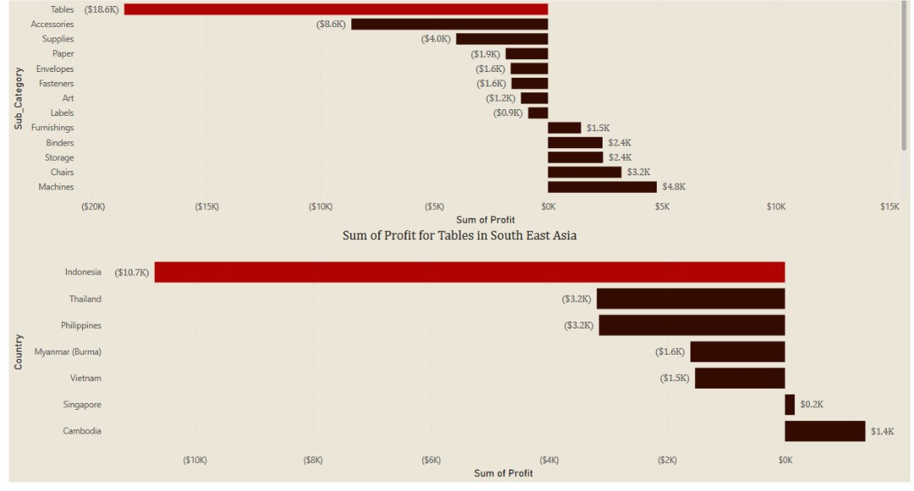
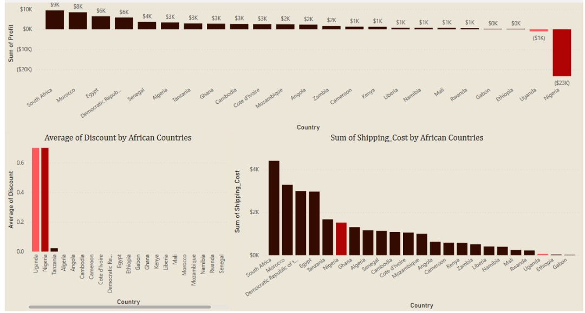
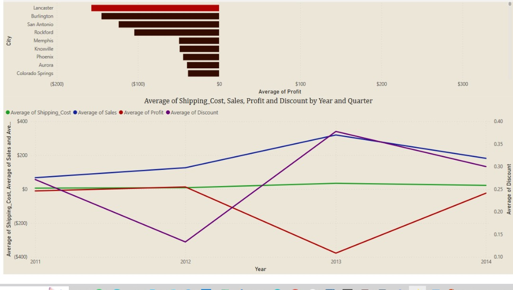
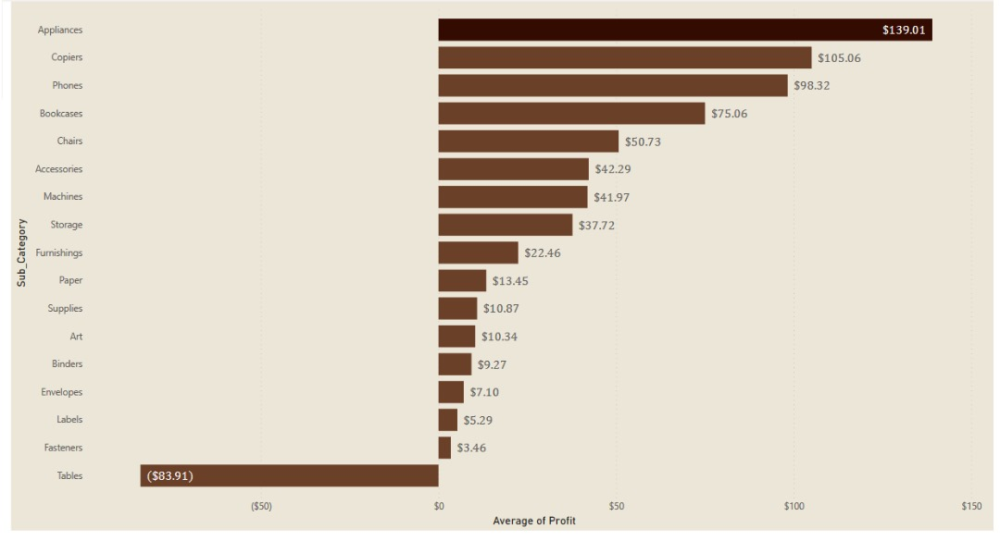
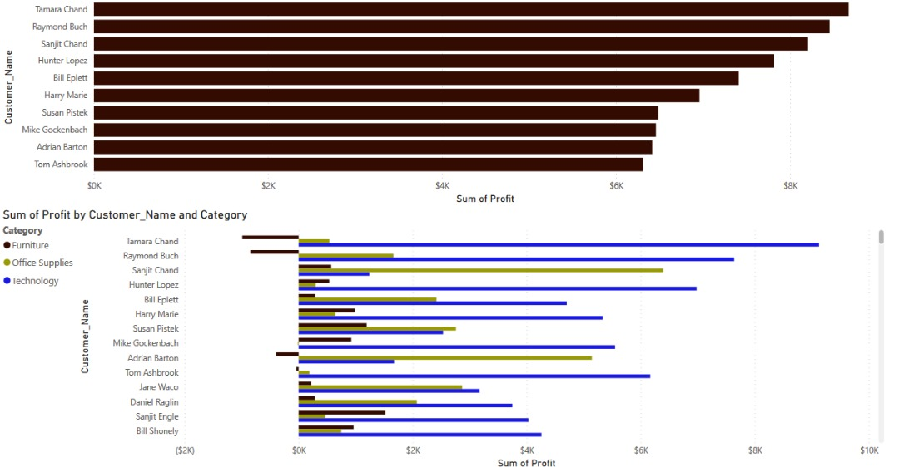

# Global-Superstore
***
##  Introduction
**Global Superstore** is a global online retailer based in New York, boasting a broad product catalog and aiming to be a one-stop-shop for its customers. Global The superstore’s clientele, hailing from 147 different countries, can browse through an endless offering with more than 10,000 products. This large selection comprises three main categories: office supplies (e.g., staples), furniture (e.g., chairs), and technology (e.g., smartphones).

## Skills Concepts demonstrated:
The following PowerBI were incorporated- 
- Dax,
- Modelling
- Page Navigation

## Problem Statement
1. What are the three countries that generated the highest total profit for Global Superstore in 2014?
2. For each of these three countries, find the three products with the highest total profit. Specifically, what are the products’ names and the total profit for each product?
3. Identify the 3 subcategories with the highest average shipping cost in the United States.
4. Assess Nigeria’s profitability (i.e., total profit) for 2014. How does it compare to other African countries?
6. What factors might be responsible for Nigeria’s poor performance? You might want to investigate shipping costs and the average discount as potential root causes.
7.  Identify the product subcategory that is the least profitable in Southeast Asia. Note: For this question, assume that Southeast Asia comprises Cambodia, Indonesia, Malaysia, Myanmar (Burma), the Philippines, Singapore, Thailand, and Vietnam.
8. Is there a specific country i n Southeast Asia where Global Superstore should stop offering the subcategory identified in 4a?
9. Which city is the least profitable (in terms of average profit) in the United States? For this analysis, discard the cities with less than 10 Orders.
    hy is this city’s average profit so low? 
10.  Which product subcategory has the highest average profit in Australia?
11.  Who are the most valuable customers and what do they purchase?

## Data Sourcing
This dataset was provided by Digitaley Drive Data Boot camp organized by as an Excel file. It contains three (3) sheets.
-	ORDERS sheet contains 51291 rows and 24 columns
- PEOPLES sheet contains 
- RETURNS sheet contains 1173 rows and 3 columns

## Data Transformation
-	The column “Postal_code” was deleted from the ORDERS table because it contained only null values.
-	The data types for “Sales”, “Quantity”, “Profit”, “Shipping_cost” was changed from whole number to Currency (Fixed decimal number).
-	Used first row as headers for PEOPLES  and RETURNS table
-	 Filtered rows to remove Empty rows for PEOPLES table
-	Created a column “Order_Year” in ORDERS table using year()
-	Removed duplicate of “Order_id” in RETURNS table leaving 1172 row from 1173 rows
- Created a column “Delivery_time” in orders table using “Delivery_time = CONVERT(Orders[Ship_Date]-Orders[Order_Date],INTEGER)”

_**PS:**_  _The data was efficiently cleaned using Power Query Editor_

## Insights Generated

- The three countries with highest total profit for Global superstore in 2014 are United States, India, China.
- The subcategories with the highest average shipping cost in the United States are Copiers, Machines and Tables
- Nigeria had a total loss of about -$23,285 in comparison with other African countries, this loss was due to the High Shipping Cost and discount.
- Tables generated the least Profit in South east Asia.Indonesia had the greatest loss from the sales of Tables. 
- The least profitable city in the United states is Lancaster this is because while the Discount rate and shipping cost were very high reducing the profit margin
- The product subcategory with the highest Average in Australia is Appliances
- Global stores most valuable customer is **Anna Andreadi** from Central region and made the most  purchase of products is in the category: Technology.

## Visualisation
The report comprises of 7 pages

- Sum of profit by three countries(United States, India and China)
  

- Average shipping cost in United States
  

- Sum of Profit for Tables in South East ASia
  

- Sum of Shipping cost by African Countries
  

- Average of Shipping_ Cost,sales,profit and discount in a Year and Quater
  

- Average of Profit(Sub catergory)
  

- Sum of Profit by Customer Name and Category
  

## CONCLUSION AND RECOMMENDATIONS

- Sum of Discount started trending up on October 2013, rising by 45.57% (273.37) in 4 quarters.  []  Sum of Discount jumped from 524.41 to 568.96 during its steepest incline between October 2012 and July 2013.  

- Between January 2012 and July 2013, Average of Shipping_Cost had the largest increase (1,353.10%) while Average of Profit had the largest decrease (5,160.67%). At $642.89, Jamestown had the highest Average of Profit and was 420.45% higher than Bethlehem, which had the lowest Average of Profit at ($200.62).  Across all 360 City, Average of Profit ranged from ($200.62) to $642.89. 

 - 5. Across all metrics, Average of Profit had the most interesting recent trend and started trending down on January 2014, falling by 45.15% (5.13) in 3 quarters.  Average of Profit dropped from -11.36 to -16.49 during its steepest decline between January 2014 and October 2014.  At $323.17, Lafayette had the highest Average of Profit and was 305.36% higher than Lancaster, which had the lowest Average of Profit at ($157.37). Across all 152 City, Average of Profit ranged from ($157.37) to $323.17. 

